# 3D marble puzzle obstacle track generator

Software application, written in Python to generate 3D printable design files (STL) of a marble obstacle track. Inspired by puzzle balls from Perplexus, Playtastic, Intrism, Magical Intellect and Sharper Image.

<p float="left">
    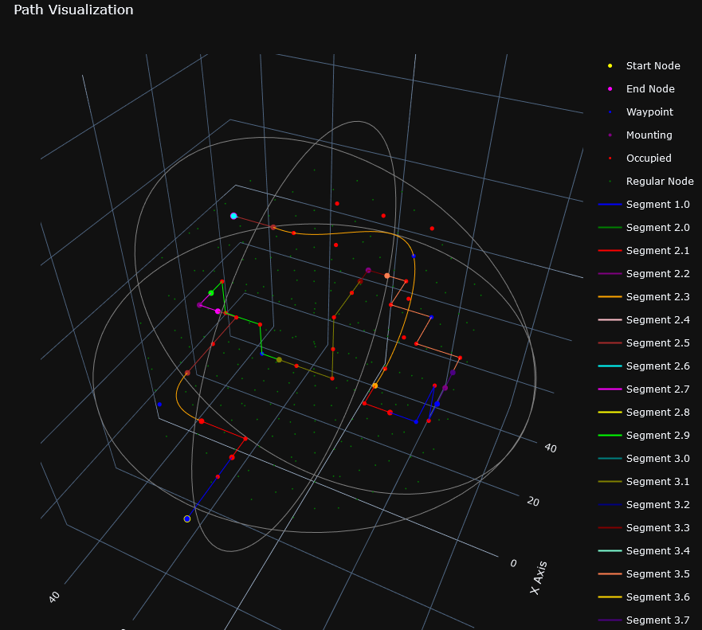
    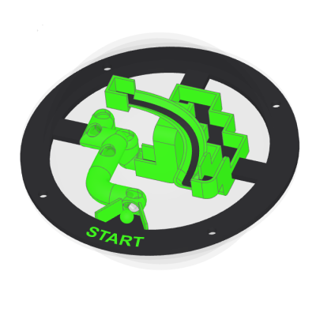
    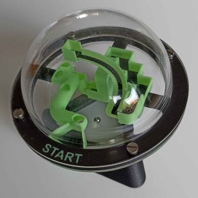
</p>

<p float="left">
    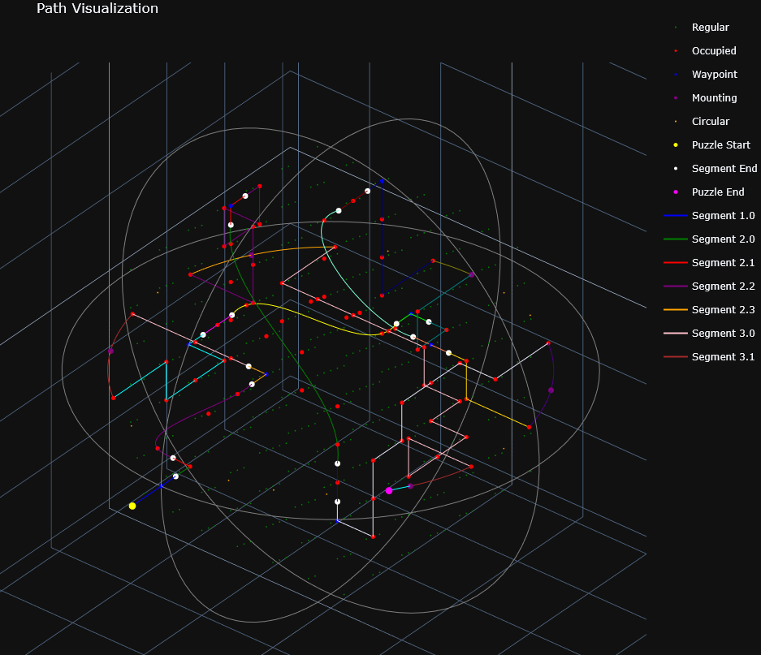
    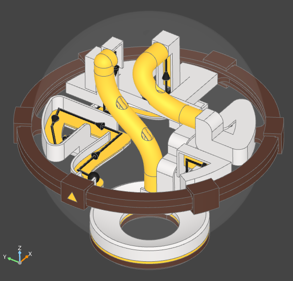
    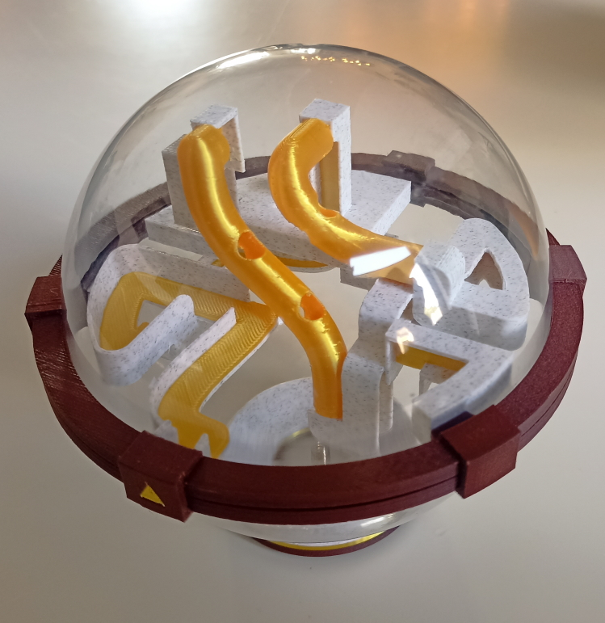
</p>

## Usage

For practicality, the application can be run in separate parts. A puzzle generation with paths and plot visualization and a 3D solid modeller that generates a puzzle and then creates and visualizes the 3D model for export. Both rely on the parameters set in the config.py file

The config.py file contains parameters that can be adjusted for type, size and shape of enclosure, path types, theme colors and more.

**Puzzle generation**

The puzzle route, for paths, curve types and node grid can be generated and visualized separately. To generate a puzzle, based on settings in the config.py file and open a visualization (Plotly-generated HTML file) in your browser, run:

```Python
generate_puzzle.py
```

Results in an HTML file which opens in the browser to showcase the enclosure shape, node grid, paths and path curve types divided by segments:

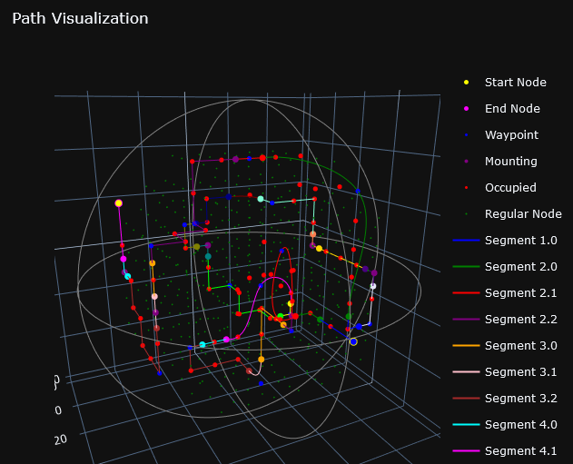</p>

**Solid modeler**

The 3D shape objects, physical enclosure are generated and visualized through the solid modeler. A puzzle is generated from which the to be made physical shapes are created by running:

```Python
solid_modeler.py
```

Results in a 3D model made out of separate solid bodies for the enclosure, path, path accent, support material and a marble path indicator:

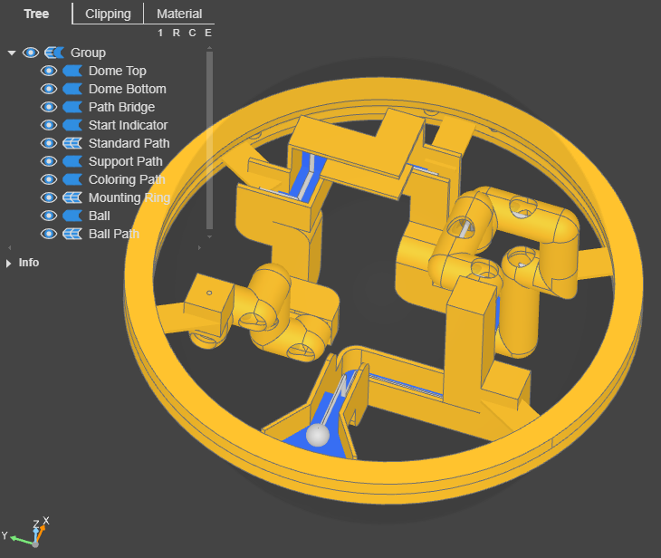

**Path Profile Overview**

For quick visualization and debugging, all the path profiles, also called
path cross sections can be 3D modelled by running:

```Python
path_profiles_overview.py
```

This results in an overview with all path profiles, including their path accent color and support material swep along a straight line. A red color color is used to indicate the path does not have any adjustments yet in the configuration:

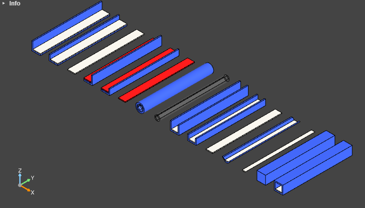

**Obstacles**

⚠️ Obstacles are work in progress, disabled by default

Obstacled can be randomly selected and placed (xyz and orientation) in the puzzle. The obstacles feature as start and end node that can be connected with paths. Through the usage of a node grid, collisions and occupancy can be handled.

For quick visualization and debugging, all the obstacles currently in the obstacle catalogue can be 3D modelled by running:

```Python
obstacle_overview.py
```

This results in the following overview:

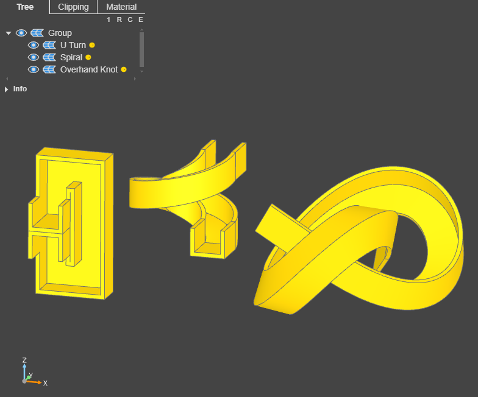

Individual obstacles can be both plotted and 3D modelled by running their individual obstacle files in /obstacles/catalogue for example, spiral.py can be run by:

```Python
python -m obstacles.catalogue.spiral
```

This results in a 3D model, including the occupied and overlap nodes:

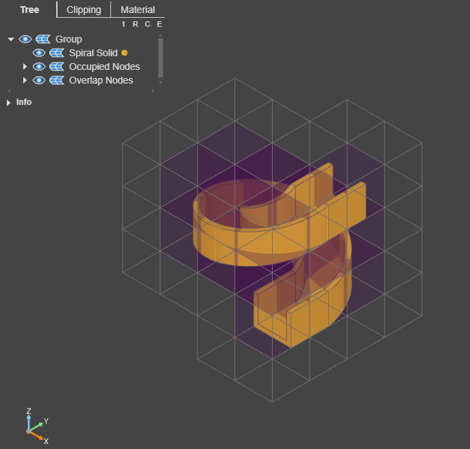

This also results in a plot, with a sampled path, occupied and overlap nodes:

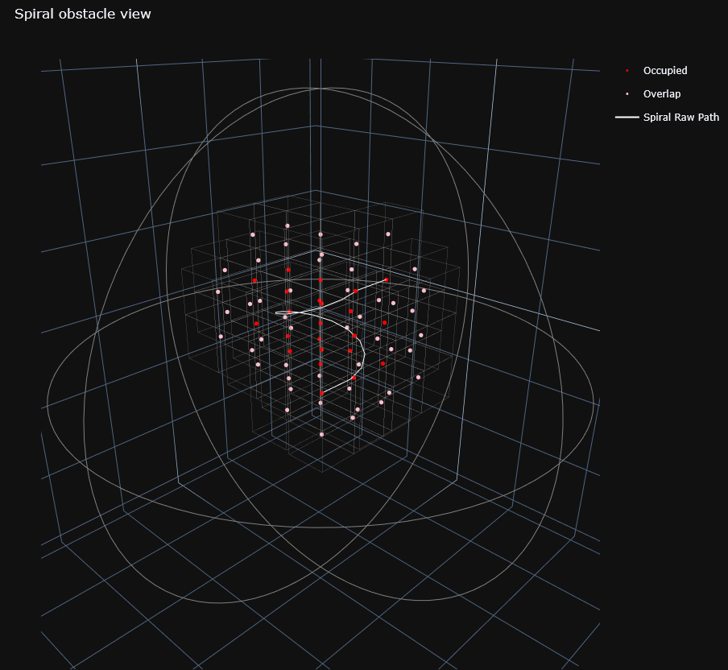

## Requirements

Python 3.11
requirements.txt is availible for dependencies

For the 3D model visualization, the [Visual Studio Code extension OCP CAD Viewer](https://marketplace.visualstudio.com/items?itemName=bernhard-42.ocp-cad-viewer) or it's [standalone mode](https://github.com/bernhard-42/vscode-ocp-cad-viewer?tab=readme-ov-file#standalone-mode) is required.

## References
- For 3D modelling, this project relies heavily on Build123: [Build123D a python CAD library]( https://github.com/gumyr/build123d)
- OCP CAD Viewer extension for Visual Studio Code to visualize 3D models: [OCP CAD Viewer for VS Code](https://github.com/bernhard-42/vscode-ocp-cad-viewer)
- Plotly for graph visualization: [Plotly Python Graphing Library](https://plotly.com/python/)
